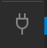
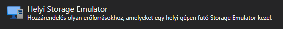
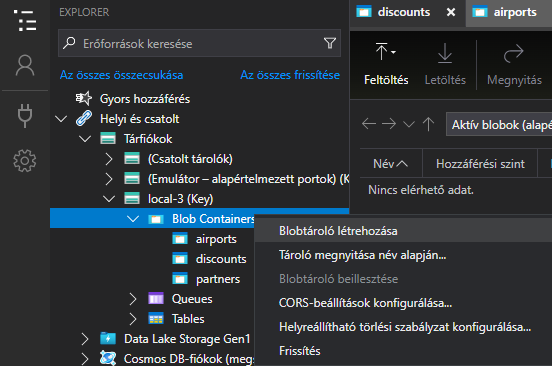
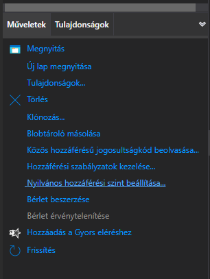
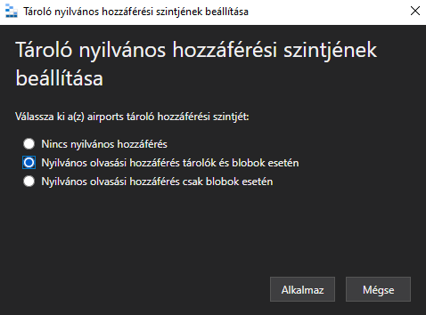

# __FlyTonight Flight Booking App__

## __How to run?__

### Frontend project

- Run `npm install` to install the necessary dependencies
- Run `npm run dev` to start the development server
- Go to http://localhost:3000 to use the app

### Backend project

- Run `dotnet run FlyTonight.API` at `./backend/FlyTonight/FlyTonight.API/` to build and run the backend api
- Api base url `https://localhost:7297/api/`
- See endpoints at `https://localhost:7297/swagger/index.html`

### Azurite blob storage

- Install `npm install -g azurite`
- Run blob storage from script `./frontend/` `npm run blob-storage`
- Start Azure Storage Explorer
- Add connection 

    

    

- **Next**, **Connect**, to add default connection
- Add `airports`, `discounts`, `partners` blob storage  
    
- Change visibility permissions

     
    
    

### MailCatcher

- Run `docker-compose up` in root of repository
    